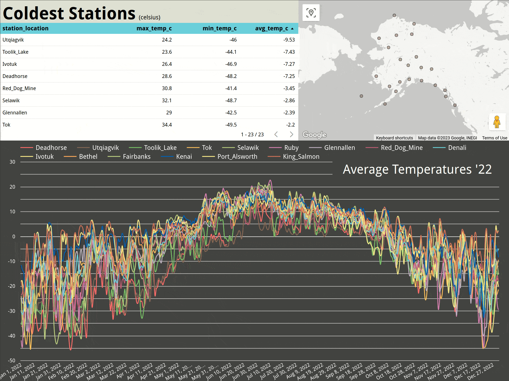

# Alaskan Weather Data _(alaska-etl)_

### "How accurate is the National Weather Service?"

#### By [Alejandro Socarras](https://alexsocarras.com)


ETL webcraping pipeline to compare NWS forecasts against data gathered by the US Climate Research Council (USCRN) throughout Alaska.

### Live [Kaggle Dataset]()


### Live [Dashboard]()



_[Dashboard Presentation](https://lookerstudio.google.com/u/0/reporting/3d8306ba-0df6-42cb-bb90-f23924a0d2c6/)_

### _**Technologies Used**_ 
* Airflow 
* Google Cloud Platform 
  * BigQuery, Cloud Functions, Cloud Scheduler, Looker Studio
* Python (Pandas, Beautiful Soup)
* SQL
  
## Project Structure 
```bash
├── airflow                   
│   ├── dags
│   │   ├── config
│   │   │    ├── gcp-config.yaml  # Set GCP info
│   │   │    └── sources.yaml     # URLs to data sources      
│   │   ├── data
│   │   ├── utils
│   │   │    └── utils.py 
│   │   ├── nws_dag.py             
│   │   ├── uscrn_dag.py
│   │   └── uscrn_wind_dag.py # wind data stored separately
│   ├── logs    # set setup/install
│   └── plugins 
├── img
├── notebooks
│   ├── 1_uscrn_scrape.ipynb
│   ├── 2_nws_update.ipynb
│   ├── 3_gcf_export.ipynb
│   └── uscrn_scrape.py          
├── README.md
└── requirements.txt
```
`./notebooks/1_uscrn_scrape.ipynb` &nbsp;- &nbsp; Explains and contains code to scrape, transform, save, and upload the main USCRN data from the hourly database and the wind data from the subhourly database. `uscrn_scrape.py` is a helper script to scrape, transform, and download the hourly data. 

`./notebooks/2_nws_update.ipynb` &nbsp;- &nbsp; Shows how to scrape weekly forecast data from the NWS.  

`./notebooks/3_gcf_export.ipynb` &nbsp;- &nbsp; Explains how to migrate our three update DAGs to Google Cloud Functions.

## Data Sources
[USCRN Hourly Historical Weather Data](https://www.ncei.noaa.gov/pub/data/uscrn/products/hourly02/): This page contains hourly weather data from the U.S. Climate Reference Network / U.S. Regional Climate Reference Network (USCRN/USRCRN) stored in text files.

[USCRN Subhourly Historical Weather Data](https://www.ncei.noaa.gov/pub/data/uscrn/products/subhourly01/): This page contains sub-hourly weather data from the same USCRN stations taken every five minutes. This database is used to access the USCRN's wind data, which have not been aggregated into the hourly database...for some reason.


[NWS Forecasts](https://forecast.weather.gov/MapClick.php?lat=60.7506&lon=-160.5006&unit=0&lg=english&FcstType=digital): The National Weather Service has forecast offices in Fairbanks and Anchorage which provide hourly forecasts by coordinate location in AK. These are available in 48-Hour blocks up to four days out, stored in a tabular format. 
  

## Setup/Installation Requirements

These instructions are for setting up Airflow to work with the scripts in `airflow/dags/`. If you'd prefer to try out Google Cloud Functions, follow the instructions in `./notebooks/3_gcf_export.ipynb` 

```bash 
# Create and activate virtual environment
virtualenv -p python3.7 venv 
source venv/bin/activate

# Install packages from requirements.txt
pip install -r requirements.txt

# Install Airflow 
AIRFLOW_VERSION=2.3.2 
PYTHON_VERSION=3.7 
CONSTRAINT_URL="https://raw.githubusercontent.com/apache/airflow/constraints-${AIRFLOW_VERSION}/constraints-${PYTHON_VERSION}.txt"
pip install "apache-airflow[async,postgres,google]==${AIRFLOW_VERSION}" --constraint "${CONSTRAINT_URL}"

# Make subdirectories 
cd airflow 
mkdir ./logs/ ./plugins/
```

### **_Docker and BigQuery Setup_**

These instructions assume you have [Docker Desktop](https://www.docker.com/products/docker-desktop/) installed. 

```bash
# Download latest docker-compose.yaml
curl -LfO 'https://airflow.apache.org/docs/apache-airflow/stable/docker-compose.yaml'
# Set the .env variable
echo -e "AIRFLOW_UID=$(id -u)\nAIRFLOW_GID=0" > .env
# (Optional) Download airflow.sh script for airflow CLI 
curl -LfO 'https://airflow.apache.org/docs/apache-airflow/2.3.2/airflow.sh'

```
Prior to initializing Airflow in Docker, you will need to [create a project](https://cloud.google.com/resource-manager/docs/creating-managing-projects) and an associated [service account](https://cloud.google.com/iam/docs/creating-managing-service-accounts) in BigQuery. After downloading the account's credential file, you can configure `docker-compose.yaml` to mount your directories and connect to BigQuery:
```yaml 
  GOOGLE_APPLICATION_CREDENTIALS: /google_creds/<name-of-your-creds-file>.json
volumes:
  - ${AIRFLOW_PROJ_DIR:-.}/dags:/opt/airflow/dags
  - ${AIRFLOW_PROJ_DIR:-.}/logs:/opt/airflow/logs
  - ${AIRFLOW_PROJ_DIR:-.}/plugins:/opt/airflow/plugins
  - </path/to/your/creds/directory>:/google_creds
```
After opening Docker Desktop (or starting docker [via CLI](https://docs.docker.com/config/daemon/start/)): 

```bash
# Initialize and run airflow 
docker compose up airflow-init 
docker compose up 
```
Lastly, change `gcp-config.yaml` to match your GCP project information (click [here](https://cloud.google.com/bigquery/docs/locations) for information on Google server locations).

```yaml
project-id: <your-project-id>
dataset-id: <your-dataset-id>
location: <your-project-location> # e.g. us-east4
credentials: </path/to/your/creds/directory>
```
Be sure to have your Docker container up before running any of the DAGs. The files in `notebooks` do not require the container to be active, however.

## Known Bugs

* No known bugs


## License

_This repo contains and builds off my work from a [team project](https://github.com/apsocarras/team-week3) at [Epicodus](https://www.epicodus.com/). No work from my teammates has been included here (modified or unmodified)._

MIT License

Copyright (c) 2023 Alejandro Socarras

Permission is hereby granted, free of charge, to any person obtaining a copy of this software and associated documentation files (the "Software"), to deal in the Software without restriction, including without limitation the rights to use, copy, modify, merge, publish, distribute, sublicense, and/or sell copies of the Software, and to permit persons to whom the Software is furnished to do so, subject to the following conditions:

The above copyright notice and this permission notice shall be included in all copies or substantial portions of the Software.

THE SOFTWARE IS PROVIDED "AS IS", WITHOUT WARRANTY OF ANY KIND, EXPRESS OR IMPLIED, INCLUDING BUT NOT LIMITED TO THE WARRANTIES OF MERCHANTABILITY, FITNESS FOR A PARTICULAR PURPOSE AND NONINFRINGEMENT. IN NO EVENT SHALL THE AUTHORS OR COPYRIGHT HOLDERS BE LIABLE FOR ANY CLAIM, DAMAGES OR OTHER LIABILITY, WHETHER IN AN ACTION OF CONTRACT, TORT OR OTHERWISE, ARISING FROM, OUT OF OR IN CONNECTION WITH THE SOFTWARE OR THE USE OR OTHER DEALINGS IN THE SOFTWARE.

</br>
